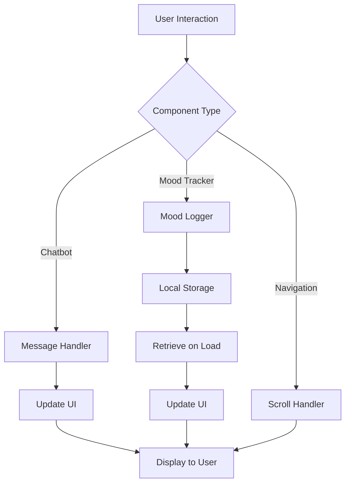

# Design Document: Mental Health Dashboard

## Overview

The Mental Health Dashboard is a single-page web application built with vanilla HTML, CSS, and JavaScript. The application provides an integrated mental wellness platform featuring an AI chatbot for supportive conversations, a mood tracking system with data visualization, educational health tips, and information about the project's alignment with UN SDG 3.

The design emphasizes accessibility, responsiveness, and a calming user experience through thoughtful color choices and smooth interactions. All user data is stored locally in the browser, ensuring privacy and offline capability.

## Architecture

### High-Level Structure

The application follows a modular, component-based architecture within a single-page application:

```
mental-health-dashboard/
├── index.html          # Main HTML structure
├── styles.css          # All styling and responsive design
└── script.js           # All JavaScript functionality
```

### Component Organization

The application is organized into logical sections:

1. **Navigation Component**: Fixed/sticky header with section links
2. **Hero Component**: Landing section with title and description
3. **Chatbot Component**: Interactive conversation interface
4. **Mood Tracker Component**: Mood logging and visualization
5. **Health Tips Component**: Card-based tips display
6. **About Component**: SDG 3 information section

### Data Flow



## Components and Interfaces

### 1. Navigation Bar Component

**HTML Structure:**
```html
<nav class="navbar">
  <div class="nav-container">
    <div class="nav-logo">Mental Health Dashboard</div>
    <ul class="nav-menu">
      <li><a href="#home">Home</a></li>
      <li><a href="#chatbot">AI Support</a></li>
      <li><a href="#mood-tracker">Mood Tracker</a></li>
      <li><a href="#tips">Health Tips</a></li>
      <li><a href="#about">About</a></li>
    </ul>
    <button class="nav-toggle" aria-label="Toggle navigation">☰</button>
  </div>
</nav>
```

**Functionality:**
- Smooth scroll navigation to sections
- Mobile hamburger menu toggle
- Active section highlighting
- Sticky positioning on scroll

**CSS Approach:**
- Flexbox for layout
- CSS transitions for menu animations
- Media queries for responsive behavior
- Z-index management for overlay

### 2. Hero Section Component

**HTML Structure:**
```html
<section id="home" class="hero">
  <div class="hero-content">
    <h1 class="hero-title">Your Mental Wellness Companion</h1>
    <p class="hero-description">
      Supporting your journey to better mental health through AI-powered 
      conversations, mood tracking, and personalized wellness tips.
    </p>
    <button class="cta-button">Get Started</button>
  </div>
</section>
```

**Styling:**
- Gradient background with calming colors
- Centered content with max-width
- Animated entrance on page load
- Responsive typography scaling

### 3. AI Chatbot Component

**HTML Structure:**
```html
<section id="chatbot" class="chatbot-section">
  <h2>AI Mental Health Support</h2>
  <div class="chat-container">
    <div class="chat-messages" id="chatMessages">
      <!-- Messages appended here dynamically -->
    </div>
    <div class="chat-input-container">
      <input type="text" id="chatInput" placeholder="Share your thoughts..." />
      <button id="sendButton">Send</button>
    </div>
  </div>
</section>
```

**JavaScript Interface:**
```javascript
// Chatbot module
const Chatbot = {
  messages: [],
  
  init() {
    // Initialize event listeners
  },
  
  sendMessage(userMessage) {
    // Add user message to conversation
    // Generate bot response
    // Update UI
  },
  
  generateResponse(userMessage) {
    // Simple pattern matching for mental health responses
    // Returns supportive message
  },
  
  displayMessage(message, sender) {
    // Render message in chat UI
  }
};
```

**Response Generation Strategy:**
- Keyword-based pattern matching (e.g., "anxious" → calming response)
- Predefined supportive responses for common mental health topics
- Default empathetic response for unmatched inputs
- No actual AI/ML model (simulated intelligent responses)

### 4. Mood Tracker Component

**HTML Structure:**
```html
<section id="mood-tracker" class="mood-tracker-section">
  <h2>Track Your Mood</h2>
  <div class="mood-selector">
    <button class="mood-btn" data-mood="great">😊 Great</button>
    <button class="mood-btn" data-mood="good">🙂 Good</button>
    <button class="mood-btn" data-mood="okay">😐 Okay</button>
    <button class="mood-btn" data-mood="sad">😢 Sad</button>
    <button class="mood-btn" data-mood="stressed">😰 Stressed</button>
  </div>
  <div class="mood-history" id="moodHistory">
    <!-- Mood logs displayed here -->
  </div>
</section>
```

**JavaScript Interface:**
```javascript
// Mood Tracker module
const MoodTracker = {
  moods: [],
  
  init() {
    // Load moods from localStorage
    // Set up event listeners
  },
  
  logMood(mood) {
    // Create mood entry with timestamp
    // Save to localStorage
    // Update display
  },
  
  saveMoods() {
    // Serialize and save to localStorage
  },
  
  loadMoods() {
    // Retrieve and parse from localStorage
  },
  
  displayMoods() {
    // Render mood history
  }
};
```

**Data Model:**
```javascript
{
  mood: "great" | "good" | "okay" | "sad" | "stressed",
  timestamp: "2024-01-15T10:30:00.000Z",
  date: "2024-01-15"
}
```

**Visualization:**
- List view showing recent mood logs with timestamps
- Color-coded mood indicators
- Optional: Simple chart showing mood trends over time

### 5. Health Tips Component

**HTML Structure:**
```html
<section id="tips" class="tips-section">
  <h2>Daily Mental Wellness Tips</h2>
  <div class="tips-grid">
    <div class="tip-card">
      <div class="tip-icon">🧘</div>
      <h3>Practice Mindfulness</h3>
      <p>Take 5 minutes daily for meditation or deep breathing exercises.</p>
    </div>
    <!-- More tip cards -->
  </div>
</section>
```

**Content Strategy:**
- 6-8 predefined mental wellness tips
- Topics: mindfulness, exercise, sleep, social connection, gratitude, etc.
- Each card has icon, title, and description

**CSS Layout:**
- CSS Grid for responsive card layout
- Hover effects for interactivity
- Card shadows and transitions

### 6. About Section Component

**HTML Structure:**
```html
<section id="about" class="about-section">
  <h2>About This Project</h2>
  <div class="about-content">
    <div class="sdg-info">
      
      <h3>Supporting SDG 3: Good Health and Well-being</h3>
      <p>
        This dashboard aligns with the United Nations Sustainable Development 
        Goal 3, which aims to ensure healthy lives and promote well-being for 
        all at all ages. Mental health is a crucial component of overall health.
      </p>
    </div>
    <div class="features-list">
      <h3>How We Support Mental Health</h3>
      <ul>
        <li>AI-powered emotional support conversations</li>
        <li>Mood tracking for self-awareness</li>
        <li>Evidence-based wellness tips</li>
        <li>Accessible, free mental health resources</li>
      </ul>
    </div>
  </div>
</section>
```

## Data Models

### Mood Entry Model

```javascript
interface MoodEntry {
  mood: "great" | "good" | "okay" | "sad" | "stressed";
  timestamp: string;  // ISO 8601 format
  date: string;       // YYYY-MM-DD format
}
```

### Chat Message Model

```javascript
interface ChatMessage {
  text: string;
  sender: "user" | "bot";
  timestamp: string;  // ISO 8601 format
}
```

### Local Storage Schema

```javascript
// Key: "mentalHealthMoods"
{
  moods: MoodEntry[]
}

// Chat messages are session-only (not persisted)
```

## Styling System

### CSS Variables

```css
:root {
  /* Color Palette - Calming Theme */
  --primary-color: #6B9BD1;      /* Soft blue */
  --secondary-color: #8BC6A8;    /* Soft green */
  --accent-color: #B19CD9;       /* Soft purple */
  --background-light: #F5F9FC;
  --background-white: #FFFFFF;
  --text-primary: #2C3E50;
  --text-secondary: #5A6C7D;
  --border-color: #E1E8ED;
  
  /* Mood Colors */
  --mood-great: #4CAF50;
  --mood-good: #8BC34A;
  --mood-okay: #FFC107;
  --mood-sad: #2196F3;
  --mood-stressed: #FF5722;
  
  /* Spacing */
  --spacing-xs: 0.5rem;
  --spacing-sm: 1rem;
  --spacing-md: 1.5rem;
  --spacing-lg: 2rem;
  --spacing-xl: 3rem;
  
  /* Typography */
  --font-primary: 'Segoe UI', Tahoma, Geneva, Verdana, sans-serif;
  --font-size-base: 16px;
  --font-size-lg: 1.25rem;
  --font-size-xl: 1.75rem;
  --font-size-xxl: 2.5rem;
  
  /* Transitions */
  --transition-fast: 0.2s ease;
  --transition-normal: 0.3s ease;
  
  /* Shadows */
  --shadow-sm: 0 2px 4px rgba(0,0,0,0.1);
  --shadow-md: 0 4px 6px rgba(0,0,0,0.1);
  --shadow-lg: 0 10px 20px rgba(0,0,0,0.15);
}
```

### Responsive Breakpoints

```css
/* Mobile: 320px - 767px */
@media (max-width: 767px) {
  /* Single column layouts */
  /* Larger touch targets */
  /* Hamburger menu */
}

/* Tablet: 768px - 1023px */
@media (min-width: 768px) and (max-width: 1023px) {
  /* 2-column grids */
  /* Optimized spacing */
}

/* Desktop: 1024px+ */
@media (min-width: 1024px) {
  /* Multi-column layouts */
  /* Hover effects */
  /* Maximum content width */
}
```

### Animation Examples

```css
/* Fade in animation */
@keyframes fadeIn {
  from { opacity: 0; transform: translateY(20px); }
  to { opacity: 1; transform: translateY(0); }
}

/* Smooth transitions */
.button {
  transition: all var(--transition-normal);
}

.button:hover {
  transform: translateY(-2px);
  box-shadow: var(--shadow-md);
}
```


## Correctness Properties

A property is a characteristic or behavior that should hold true across all valid executions of a system—essentially, a formal statement about what the system should do. Properties serve as the bridge between human-readable specifications and machine-verifiable correctness guarantees.

### Property 1: Navigation link functionality

*For any* navigation link in the navbar, clicking it should result in the corresponding section being scrolled to or displayed.

**Validates: Requirements 1.2**

### Property 2: Chatbot message display

*For any* user message submitted to the chatbot, the message should appear in the conversation history with the correct sender designation.

**Validates: Requirements 3.2, 3.4**

### Property 3: Chatbot response generation

*For any* user message submitted to the chatbot, a bot response should be generated and displayed in the conversation.

**Validates: Requirements 3.3**

### Property 4: Message visual distinction

*For any* message in the chatbot, user messages and bot messages should have different CSS classes or visual styling applied.

**Validates: Requirements 3.5**

### Property 5: Chat scrollability

*For any* chatbot conversation, when the number of messages exceeds the visible area height, the chat container should be scrollable.

**Validates: Requirements 3.6**

### Property 6: Mood logging with timestamp

*For any* mood selection, logging the mood should create a record that includes both the mood value and a timestamp.

**Validates: Requirements 4.2**

### Property 7: Mood persistence round-trip

*For any* mood entry, logging it to the mood tracker should persist it to localStorage, and reloading the page should retrieve and display the same mood entry.

**Validates: Requirements 4.3, 4.5, 9.1, 9.2**

### Property 8: Mood display after logging

*For any* mood logged, the mood tracker should display a visual representation of that mood in the mood history.

**Validates: Requirements 4.4**

### Property 9: LocalStorage data parsing

*For any* valid mood data structure in localStorage, the dashboard should correctly parse and display the mood entries without errors.

**Validates: Requirements 9.3**

### Property 10: LocalStorage error handling

*For any* scenario where localStorage is unavailable or throws an error, the dashboard should handle the error gracefully and continue functioning without crashing.

**Validates: Requirements 9.4**

### Property 11: Color scheme consistency

*For any* major section of the dashboard (hero, chatbot, mood tracker, tips, about), the section should use colors from the defined calming palette (soft blues, greens, purples).

**Validates: Requirements 2.3, 5.5, 7.1**

### Property 12: Interactive element transitions

*For any* interactive element (buttons, links, cards), the element should have CSS transition or animation properties defined for smooth interactions.

**Validates: Requirements 7.3**

### Property 13: Mobile responsive layout

*For any* viewport width in the mobile range (320px-767px), the dashboard should display content in a single-column layout with appropriate spacing.

**Validates: Requirements 8.1**

### Property 14: Tablet responsive layout

*For any* viewport width in the tablet range (768px-1023px), the dashboard should optimize layout for medium screens with appropriate multi-column arrangements.

**Validates: Requirements 8.2**

### Property 15: Desktop responsive layout

*For any* viewport width in the desktop range (1024px+), the dashboard should utilize available screen space with multi-column layouts and appropriate maximum widths.

**Validates: Requirements 8.3**

### Property 16: Touch-friendly interactive elements

*For any* interactive element on mobile viewports, the element should meet minimum touch target size requirements (44x44px or larger).

**Validates: Requirements 8.5**

### Property 17: Navbar accessibility across viewports

*For any* viewport size (mobile, tablet, desktop), the navigation bar should remain accessible and functional.

**Validates: Requirements 1.3**

### Property 18: Responsive tips section

*For any* viewport size, the health tips section should adapt its grid layout appropriately (1 column on mobile, 2 columns on tablet, 3+ columns on desktop).

**Validates: Requirements 5.4**

### Property 19: Hero section responsiveness

*For any* viewport size, the hero section should render properly with appropriate typography scaling and spacing.

**Validates: Requirements 2.4**

### Property 20: ARIA labels for interactive elements

*For any* interactive element that lacks visible text labels, the element should have an appropriate aria-label or aria-labelledby attribute.

**Validates: Requirements 10.2**

### Property 21: Color contrast compliance

*For any* text element in the dashboard, the text color and background color combination should meet WCAG AA contrast ratio requirements (4.5:1 for normal text, 3:1 for large text).

**Validates: Requirements 10.3**

### Property 22: Keyboard navigation support

*For any* interactive feature (navigation links, buttons, form inputs), the element should be keyboard accessible (focusable and operable via keyboard).

**Validates: Requirements 10.4**

### Property 23: Focus indicator visibility

*For any* focusable element, when focused via keyboard navigation, the element should display a visible focus indicator.

**Validates: Requirements 10.5**

## Error Handling

### Chatbot Error Handling

**Empty Message Submission:**
- Prevent submission of empty or whitespace-only messages
- Display subtle feedback to user (e.g., shake animation on input field)
- Keep input field focused for user to try again

**Response Generation Failure:**
- If pattern matching fails, provide a default empathetic response
- Never leave user message without a response
- Log errors to console for debugging

### Mood Tracker Error Handling

**LocalStorage Unavailable:**
- Detect localStorage availability on page load
- If unavailable, display a warning message to user
- Allow mood tracking to continue in-memory for current session
- Gracefully degrade functionality without breaking the app

**LocalStorage Quota Exceeded:**
- Catch QuotaExceededError when saving moods
- Implement data cleanup (remove oldest entries if needed)
- Notify user if data cannot be saved

**Invalid Data in LocalStorage:**
- Validate data structure when loading from localStorage
- If data is corrupted, clear it and start fresh
- Log warning to console
- Don't crash the application

### General Error Handling

**JavaScript Errors:**
- Wrap critical functionality in try-catch blocks
- Log errors to console with context
- Provide user-friendly error messages when appropriate
- Ensure one component's failure doesn't break others

**Network/Resource Loading:**
- Not applicable for this pure client-side application
- All resources (HTML, CSS, JS) loaded together

## Testing Strategy

### Dual Testing Approach

This project requires both unit testing and property-based testing for comprehensive coverage:

- **Unit tests**: Verify specific examples, edge cases, and error conditions
- **Property tests**: Verify universal properties across all inputs

Both testing approaches are complementary and necessary. Unit tests catch concrete bugs in specific scenarios, while property tests verify general correctness across a wide range of inputs.

### Unit Testing

**Focus Areas:**
- Specific UI component rendering (navbar exists, hero section has title, etc.)
- Edge cases (empty messages, invalid localStorage data)
- Error conditions (localStorage unavailable, quota exceeded)
- Integration points between components
- Specific user interactions (clicking a mood button, sending a chat message)

**Testing Tools:**
- Jest or Vitest for JavaScript testing
- jsdom for DOM manipulation testing
- Testing Library for user interaction simulation

**Example Unit Tests:**
```javascript
// Example: Test that navbar contains all required links
test('navbar contains all navigation links', () => {
  const navbar = document.querySelector('.navbar');
  const links = navbar.querySelectorAll('a');
  expect(links.length).toBe(5);
  expect(links[0].textContent).toBe('Home');
  // ... etc
});

// Example: Test empty message prevention
test('chatbot prevents empty message submission', () => {
  const input = document.getElementById('chatInput');
  const sendButton = document.getElementById('sendButton');
  input.value = '   '; // whitespace only
  sendButton.click();
  const messages = document.querySelectorAll('.chat-message');
  expect(messages.length).toBe(0);
});
```

### Property-Based Testing

**Property Testing Library:**
- Use **fast-check** for JavaScript property-based testing
- Configure each test to run minimum 100 iterations
- Tag each test with a comment referencing the design property

**Focus Areas:**
- Universal behaviors that should hold for all inputs
- Round-trip properties (save/load mood data)
- Responsive behavior across viewport ranges
- Message display and conversation history
- Color scheme consistency across components

**Property Test Configuration:**
```javascript
import fc from 'fast-check';

// Each property test should run at least 100 iterations
const testConfig = { numRuns: 100 };
```

**Example Property Tests:**
```javascript
// Feature: mental-health-dashboard, Property 2: Chatbot message display
test('any user message appears in conversation history', () => {
  fc.assert(
    fc.property(
      fc.string({ minLength: 1, maxLength: 500 }), // Generate random messages
      (userMessage) => {
        Chatbot.sendMessage(userMessage);
        const messages = document.querySelectorAll('.chat-message.user');
        const lastMessage = messages[messages.length - 1];
        expect(lastMessage.textContent).toContain(userMessage);
      }
    ),
    testConfig
  );
});

// Feature: mental-health-dashboard, Property 7: Mood persistence round-trip
test('any logged mood persists and loads correctly', () => {
  fc.assert(
    fc.property(
      fc.constantFrom('great', 'good', 'okay', 'sad', 'stressed'),
      (mood) => {
        // Clear localStorage
        localStorage.clear();
        
        // Log mood
        MoodTracker.logMood(mood);
        
        // Simulate page reload by creating new instance
        const newTracker = Object.create(MoodTracker);
        newTracker.loadMoods();
        
        // Verify mood was persisted
        expect(newTracker.moods.length).toBe(1);
        expect(newTracker.moods[0].mood).toBe(mood);
        expect(newTracker.moods[0].timestamp).toBeDefined();
      }
    ),
    testConfig
  );
});

// Feature: mental-health-dashboard, Property 13: Mobile responsive layout
test('any mobile viewport width displays single-column layout', () => {
  fc.assert(
    fc.property(
      fc.integer({ min: 320, max: 767 }), // Mobile viewport range
      (viewportWidth) => {
        // Set viewport width
        window.innerWidth = viewportWidth;
        window.dispatchEvent(new Event('resize'));
        
        // Check that main content sections are single-column
        const sections = document.querySelectorAll('section');
        sections.forEach(section => {
          const computedStyle = window.getComputedStyle(section);
          const gridColumns = computedStyle.gridTemplateColumns;
          // Should be single column or no grid
          expect(gridColumns === 'none' || gridColumns.split(' ').length === 1).toBe(true);
        });
      }
    ),
    testConfig
  );
});
```

### Test Coverage Goals

- **Unit Test Coverage**: Aim for 80%+ code coverage
- **Property Test Coverage**: All 23 correctness properties implemented as property tests
- **Integration Testing**: Test component interactions (chatbot + localStorage, mood tracker + UI updates)
- **Accessibility Testing**: Automated tests for WCAG compliance (color contrast, ARIA labels, keyboard navigation)

### Testing Execution

**Development Workflow:**
1. Write unit tests for specific functionality
2. Write property tests for universal behaviors
3. Run tests frequently during development
4. Ensure all tests pass before considering feature complete

**Continuous Testing:**
- Run tests on every code change
- Use watch mode during development
- Integrate with CI/CD if deploying to production

### Manual Testing Checklist

While automated tests cover most functionality, manual testing should verify:
- Visual design quality and aesthetics
- Smooth animations and transitions
- Cross-browser compatibility (Chrome, Firefox, Safari, Edge)
- Mobile device testing (actual devices, not just browser DevTools)
- User experience flow and intuitiveness
- Accessibility with screen readers (NVDA, JAWS, VoiceOver)

